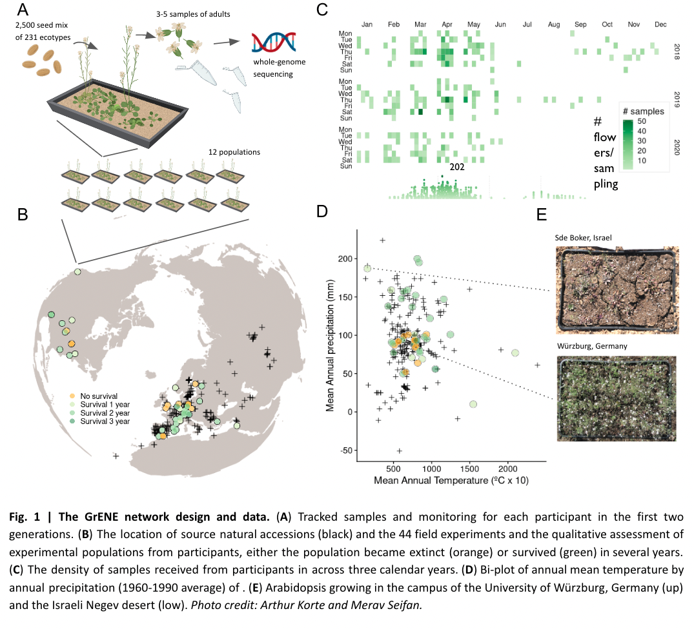

All the sites where Arabidopsis has been growing for the past 4 years!
 

&nbsp

Number of flowers collected across the years 
 

&nbsp

 
Evolution by means of natural selection is the core theme in evolutionary research. Recently, the recognition that rapid evolutionary processes occur widely in nature gave impetus to investigate adaptation of populations to their immediate environmental conditions. Experimental evolution, where evolution is studied in action rather than as the outcome of past processes, is the gold standard in evolutionary research. Such endeavours will yield valuable insight into the process of adaptation.

GrENE-net – Genomics of rapid Evolution in Novel Environments – is set up as a coordinated distributed experiment with Arabidopsis thaliana. Its aim is to combine efforts to conduct a large evolution experiment . We invite researchers from across the globe to participate in GrENE-net.

Participants will receive seed mixtures of c. 200 natural accessions of Arabidopsis thaliana which they will sow into small replicated plots. Every year, participants will sample plant material used for genome sequencing which allows to track changes in the abundances of alleles and accessions. Coupled with weather and soil data, we aim to unravel the process of adaptation to these important environmental variables. Our selection experiment will thus increase understanding of how the environment, plant phenotypes and their genetic makeup are linked together and about the evolutionary dynamics behind it. 

