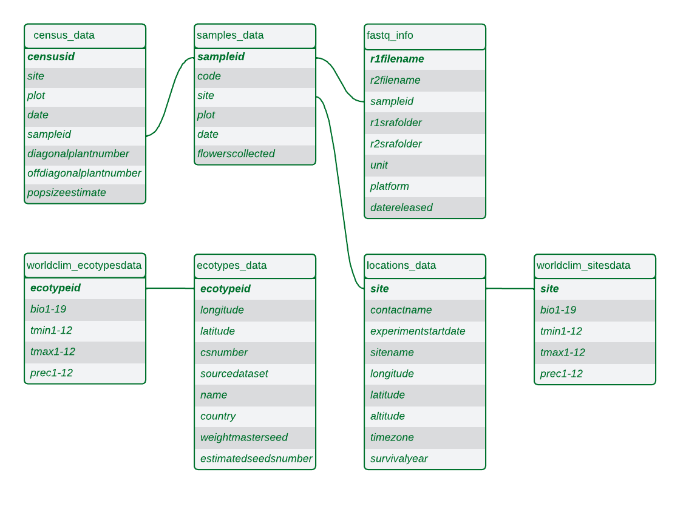



The GrENE-net project provides comprehensive metadata and genomic data through the [GreneR Package](https://github.com/moiexpositoalonsolab/grene). Below is a detailed description of our data structure and available datasets:

## Data Structure

Our data is organized into several interconnected tables that capture different aspects of the experiment:

1. **Population Monitoring Data**
   - `census_data`: Tracks population sizes and growth dynamics across all experimental plots
   - `samples_data`: Records of all flower samples collected throughout the experiment

2. **Genomic Data Processing**
   - `fastq_info`: Metadata required for processing raw sequencing data using [grenepipe](https://github.com/moiexpositoalonsolab/grenepipe) (this table is the input needed to run grenepipe from the raw fastq files and calculate different population genetics parameters such as allele frequencies and fst)

3. **Genetic Diversity Data**
   - `ecotypes_data`: Information about the 230 natural accessions used in the experiment
   - `worldclim_ecotypesdata`: Climate data from the original collection sites of these accessions

4. **Experimental Site Data**
   - `locations_data`: Details about the 45 experimental sites worldwide
   - `worldclim_sitesdata`: Climate data for each experimental site

## Available Datasets

You can directly download the following datasets:

| Dataset | Description | Download |
|---------|-------------|----------|
| Census Data | Population size measurements across experimental plots | [Download](https://raw.githubusercontent.com/moiexpositoalonsolab/grene/master/data/census.tsv) |
| Samples Data | Flower sampling records and metadata | [Download](https://raw.githubusercontent.com/moiexpositoalonsolab/grene/master/data/records.tsv) |
| Ecotypes Data | Information about founder accessions | [Download](https://raw.githubusercontent.com/moiexpositoalonsolab/grene/master/data/ecotypes.tsv) |
| Climate Data (Ecotypes) | Climate data from collection sites | [Download](https://raw.githubusercontent.com/moiexpositoalonsolab/grene/master/data/ecotypes.clim.tsv) |
| Sites Data | Experimental site information | [Download](https://github.com/moiexpositoalonsolab/grene/blob/master/data/sitesinfo.rda) |
| Climate Data (Sites) | Climate data from experimental sites | [Download](https://raw.githubusercontent.com/moiexpositoalonsolab/grene/master/data/sites.clim.tsv) |

## Coming Soon
- Raw FASTQ files from all samples
- Allele frequency tables (processed with HAF-pipe)
- Downstream analyses (e.g., FST calculations)

For more detailed information about the data structure and how to use it, please refer to the [GreneR Package documentation](https://github.com/moiexpositoalonsolab/grene).

---

When using our data, please cite the appropriate publications

