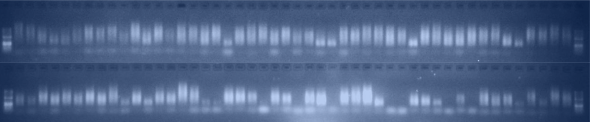

Despite the challenges that 2020 brought, our lab in the Carnegie Department of Plant Biology at Stanford, has been working to process the GrENE-net samples, so we thought we’d share some pictures with landmark events!

It all started late in February 2020. Not COVID-19, but the over 1,600 samples from GrENE-net seasons 2018 and 2019 that arrived to their final destination, our lab. As all labs in Stanford were closing down mid-March, we were sorting through samples in our -80C freezer. And when I say we, it is mostly Yunru (Ru) Peng, the fearless technician that is spearheading sample processing, extraction, library preparation, and sequencing, of GrENE-net.

Unsurprisingly, verifying the correspondence of every sample with online spreadsheets filled by participants in ~45 different locations, took a while. But the records matched remarkably well the samples received (confession: I was a bit scared of samples miss-labeling or directly erased labels … phew).

We were setting up the molecular lab so there was a lot of ordering of all the reagents and equipment we needed (see first order below!).

Picture of Ru Peng (laboratory technician) and Moisés Expósito-Alonso (PI and GrENE-net co-coordinator), holding the first Illumina reagents to sequence the GrENE-net samples! (Note: picture taken pre-COVID times)

Because of the large amount of samples (more from 2020+ are expected), we wanted to use protocols that would be very cheap (<$3/sample). After grinding, we followed DNA extractions using the well-known Chlorophorm approach, which although difficult to handle, is quite efficient. On the way, we learned that this protocol (sometimes called CTAB method) had been first applied to plants in our own Carnegie department in the 80s! (before was normally used for bacterial DNA extractions).

But we needed throughput, so once it worked per sample smoothly [side story, the protocol was not working after the lab partially re-opened because buffers were likely unsterile — who knows what happened during pandemic lockdown], we tested materials and equipment to do 96 samples at a time (see plate glamour shot).

Plate glamour shot with 96 GrENE-net samples freshly extracted for DNA. Note there is some Chlorophyl giving the green color, and likely also other small amounts of yellow pigments from the flowers. (Picture courtesy of Ru Peng)

Same procedure was taken for the NGS library protocol. Like DNA extraction “kits”, library preparation kits are quite expensive for that many samples so we wanted a home-cooked method. We adopted the down-scaled Nextera protocol circulating across labs since Baym et al (2015, PLOS One), with the help of our colleagues Shreya Banerjee and Molly Schumer. Below you can see a beautiful large gel of 96 samples after library amplification (and before size cleanup)!

An example a gel of 96 Whole-Genome NGS libraries, where you can see bands around 500 bp. Variable intensity is likely due to differential success in preserving samples from field experiments (sometimes quite remote to the lab), as well as differential survival of plants across environments, leading to sometimes only 1-2 individuals to survive and sampled in a location. (Picture courtesy of Ru Peng)

All in all, as I write, there have been a fraction of samples for which we already have whole-genome sequences, so we will keep working on processing samples, and look forward to an exciting 2021 of more sequencing and data analysis to learn new insights on short-term evolutionary dynamics under different climates!

